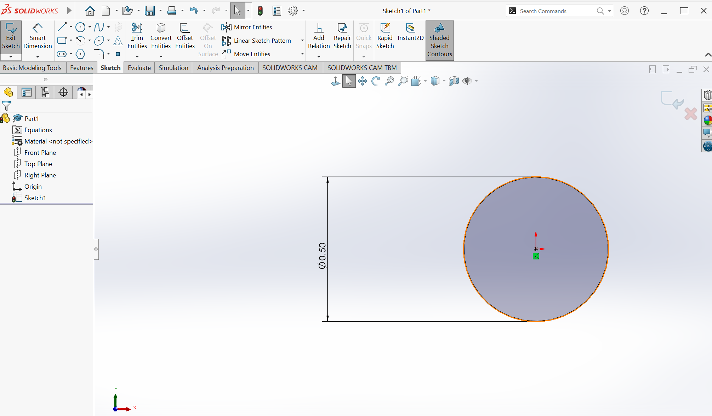
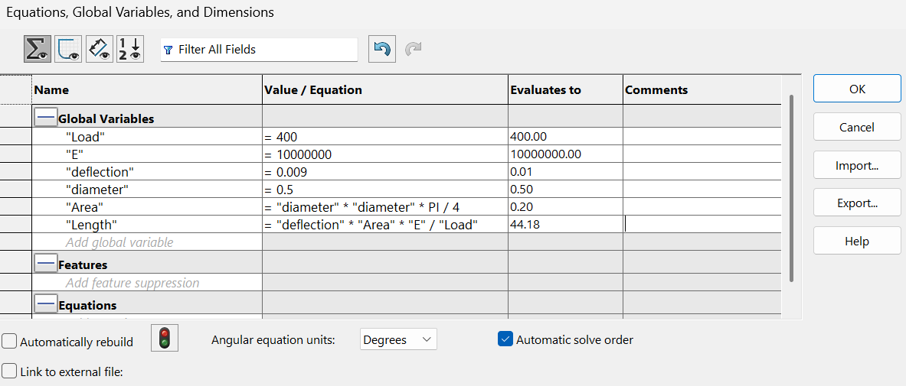
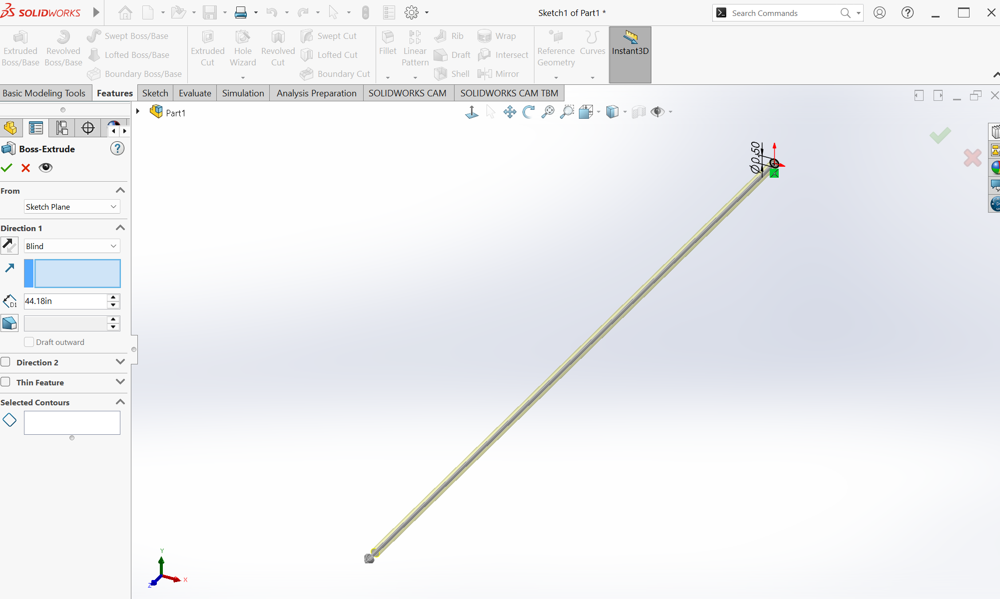
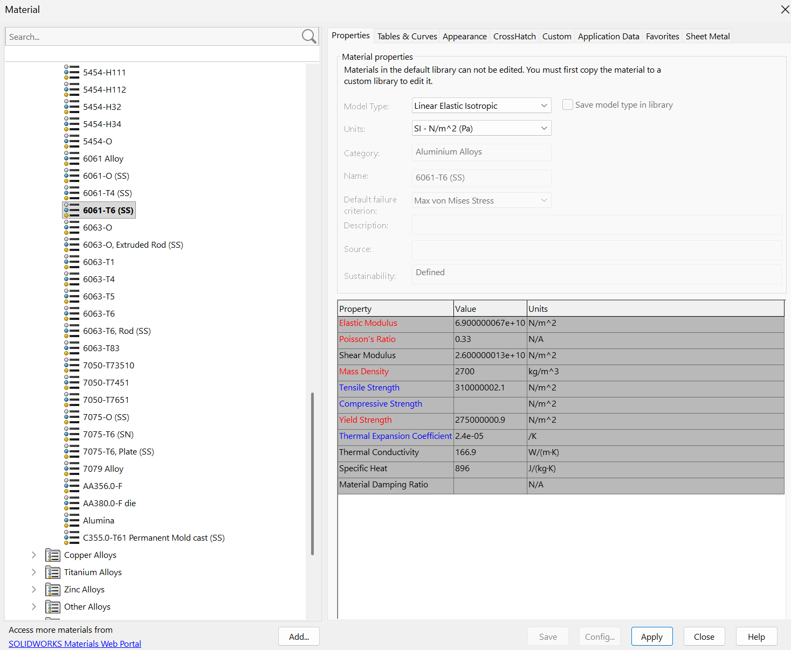
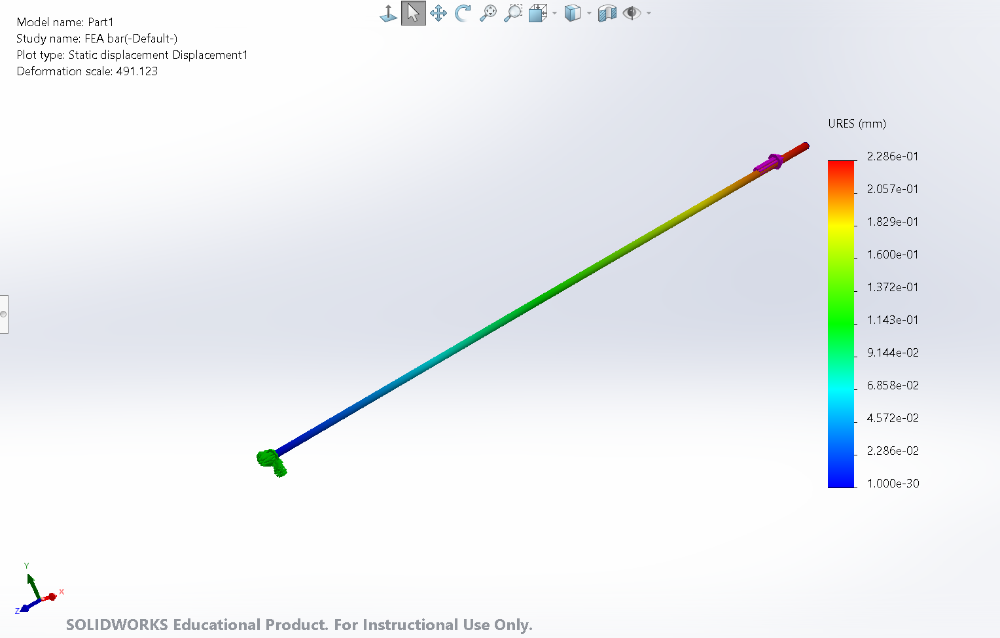
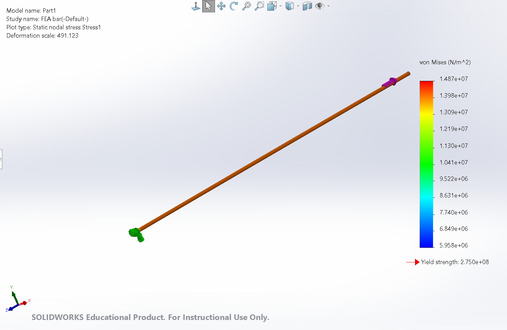
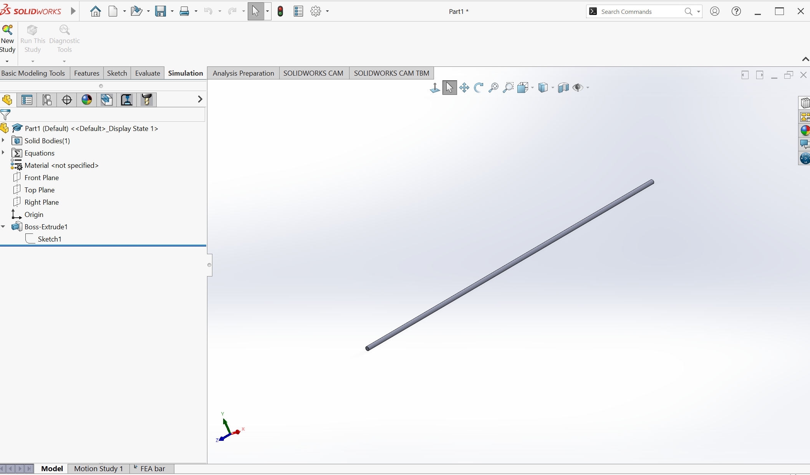
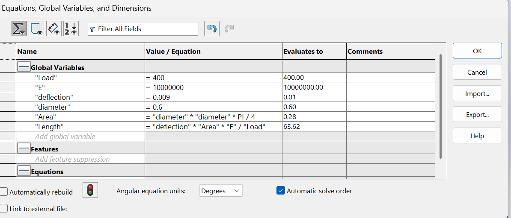
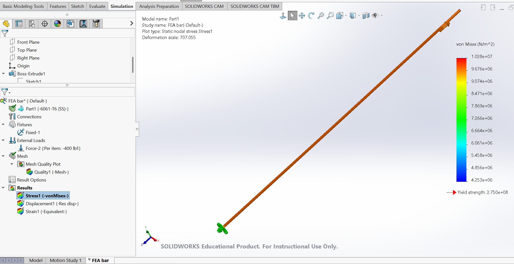
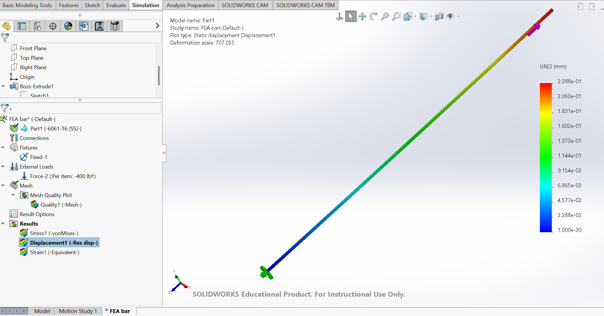

# A3 – Parametric Design and FEA

## Objective - The objective of this assignment was to design a parametric aluminum bar in SOLIDWORKS that would experience a specified axial deflection under a 400 lbf load. The bar dimensions were determined analytically and then evaluated using finite element analysis (FEA). The design was also evaluated for stress, factor of safety, and the effect of a stress concentration.

## Analyze
The bar was first analyzed using the axial deformation equation

δ = FL / AE

where δ is the axial deformation, F is the applied load, L is the bar length, A is the cross-sectional area, and E is the elastic modulus.

The initial design used a 0.50 in diameter, a 400 lbf axial load, an elastic modulus of 10.0 × 10^6 psi, and a target deflection of 0.009 in.
The bar was first analyzed using the axial deformation equation
### Initial Design

The initial bar was modeled with a diameter of 0.50 in. The required length was calculated using

δ = FL / AE

Solving for length,

L = δAE / F

A = πd² / 4 = π(0.50 in)² / 4 = 0.1963 in²

L = (0.009 in)(0.1963 in²)(10.0 × 10^6 psi) / (400 lbf)

L = 44.18 in

The calculated dimensions were then used to create the initial parametric model in SOLIDWORKS.

*Figure 1. Initial bar geometry using a 0.50 in diameter.*

*Figure 2. Initial parametric bar model created in SOLIDWORKS.*
### Material and FEA Setup

The bar was assigned 6061-T6 aluminum in SOLIDWORKS. The material properties were used for the finite element analysis, including the elastic modulus and yield strength.

*Figure 3. 6061-T6 aluminum material properties used for the FEA.*

A static study was then created with one end of the bar fixed and a 400 lbf axial load applied to the opposite end.

*Figure 4. FEA boundary conditions and applied 400 lbf axial load.*

### Initial FEA Results

The initial design was analyzed for stress and displacement. The maximum von Mises stress was approximately 1.487 × 10^7 N/m².

*Figure 5. Von Mises stress results for the initial bar design.*

The maximum resultant displacement was approximately 0.2286 mm.

*Figure 6. Displacement results for the initial bar design.*
### Parametric Design Revision

The design was then modified parametrically by increasing the bar diameter from 0.50 in to 0.60 in. Because the required length depends on the cross-sectional area, increasing the diameter also increased the required bar length.

A = πd² / 4

A = π(0.60 in)² / 4

A = 0.2827 in²

L = δAE / F

L = (0.009 in)(0.2827 in²)(10.0 × 10^6 psi) / (400 lbf)

L = 63.62 in

*Figure 7. Updated parametric equations for the 0.60 in diameter design.*

The parametric model automatically updated to the new diameter and calculated length.

*Figure 8. Updated bar geometry after increasing the diameter to 0.60 in.*

### Revised FEA Results

The revised design was evaluated using the same 400 lbf axial load and boundary conditions.

*Figure 9. Von Mises stress results for the revised parametric bar.*

*Figure 10. Displacement results for the revised parametric bar.*
### Hand Calculations

The analytical calculations used to determine the required bar dimensions were completed by hand before comparing the design with the SOLIDWORKS FEA results.

[View Hand Calculations](CamScanner%209-10-26%2007.17.pdf)

## Decide
The analytical calculations and FEA results were compared to evaluate the design. Increasing the diameter from 0.50 in to 0.60 in increased the cross-sectional area and allowed the bar to be longer while maintaining the specified axial deflection. The FEA results also showed that the stresses remained well below the yield strength of 6061-T6 aluminum. Based on these results, the revised 0.60 in diameter design was acceptable.

## Communicate
A parametric 6061-T6 aluminum bar was successfully designed and evaluated using analytical calculations and SOLIDWORKS Simulation. The model demonstrated how changing the diameter automatically changes the required length while maintaining the target axial deflection. FEA was used to verify the displacement and stress behavior of the design.
### Reflection

One of the most difficult parts of this assignment was correctly modifying the parametric design. When the diameter was changed, the required length also changed because the cross-sectional area is part of the axial deformation equation. Initially, the SOLIDWORKS model did not update as expected, and the load was still associated with the previous geometry. This caused the FEA results to be incorrect.

After correcting the model, equations, and load location, the simulation produced results that were consistent with the revised design. This process showed the importance of checking that equations, dimensions, loads, and boundary conditions all update correctly when making changes to a parametric model. It also demonstrated how parametric modeling can make design changes much faster once the relationships between the variables are set up correctly.

